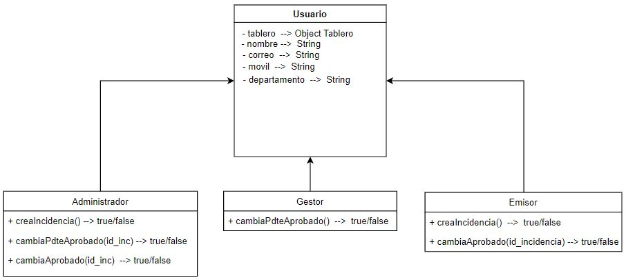
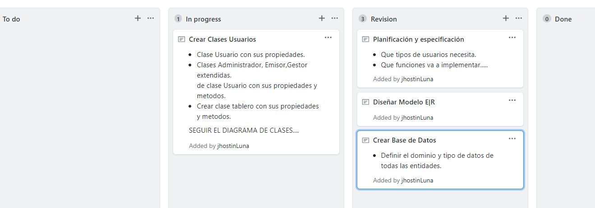

# Gest-On
Gestor de Incidencias

## Planificacion Proyecto  
Wireframes creados.....
  
Diagrama de Estados (Creado, Asignado, Pendiente de aprovado, completado)  
  

Creo El diagrama de Entidad Relación:  

- Tablero Kanban Actual:  

**Trabajo de 04/04/2020**  

Diagrama de clases:  

**05/04/2020**
Definir dominio y tipo de entidades:  

CREATE DATABASE IF NOT EXIST GestionInc;  
use GestionInc;  
CREATE TABLE IF NOT EXIST usuario 	VALUES(  
dni varchar(9) NOT NULL,  
nombre varchar(9) NOT NULL,  
apellidos varchar(20) NOT NULL,  
correo varchar(30) NOT NULL,  
tipo varchar(2) NOT NULL,  
clave varchar(12) NOT NULL,  
id_deptno int(11) NOT NULL AUTO_INCREMENT,  
PRIMARY KEY (dni)  
);  

CREATE TABLE IF NOT EXIST departamentos VALUES(  
id_deptno int(11),  
nombre varchar(15),  
admin varchar(9),  
ciudad varchar(10),  
cp varchar(5),  
PRIMARY KEY (id_deptno)  
);  

CREATE TABLE IF NOT EXIST incidencias VALUES(  
id_inc NOT NULL AUTO_INCREMENT,  
asunto varchar(15),  
prioridad varchar(5),  
estado varchar(15),  
gestor varchar(),  
f_creacion date,  
dni varchar(9),  
id_deptno varchar(11),  
FOREIGN KEY (id_deptno) REFERENCE departamento(id_deptno),  
FOREIGN KEY (dni) REFERENCE usuario(dni) ON DELETE CASCADE|RESTRICT,  
FOREIGN KEY (gestor) REFERENCE usuario(dni) ON DELETE CASCADE|RESTRICT,  
PRIMARY KEY (id_inc)  
);  

