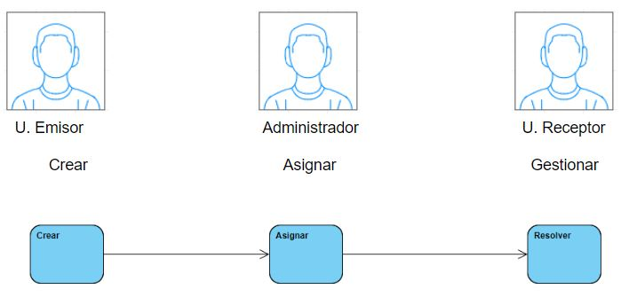
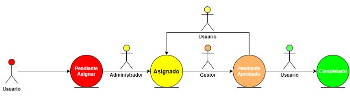
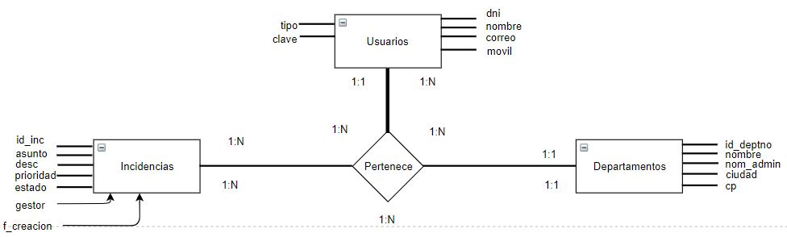
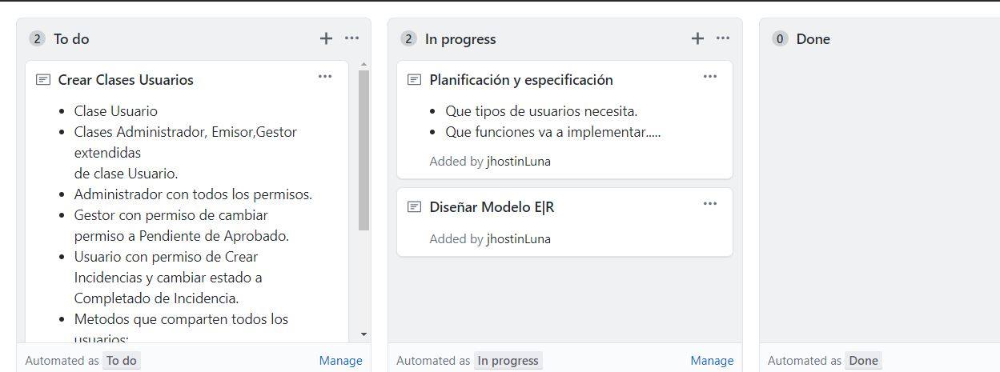
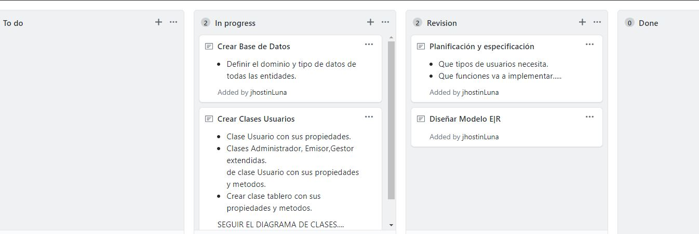

# Gest-On
Gestor de Incidencias

## Planificacion Proyecto  
Wireframes creados.....
  
Diagrama de Estados (Creado, Asignado, Pendiente de aprovado, completado)  
  

Creo El diagrama de Entidad Relación:  

- Tablero Kanban Actual:  

**Trabajo de 04/04/2020**  

